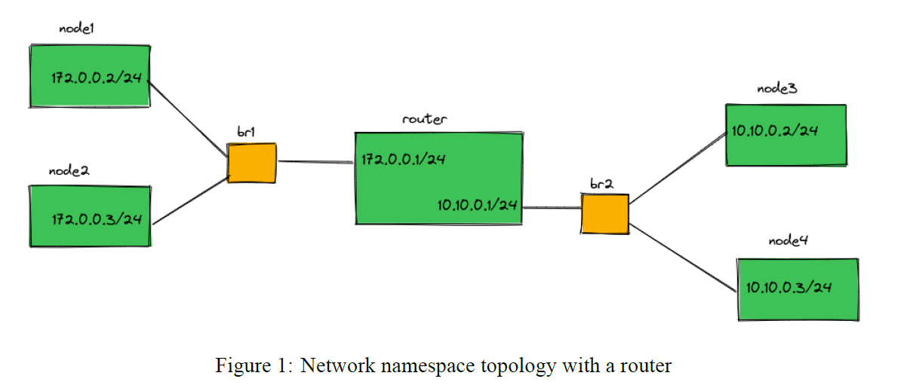
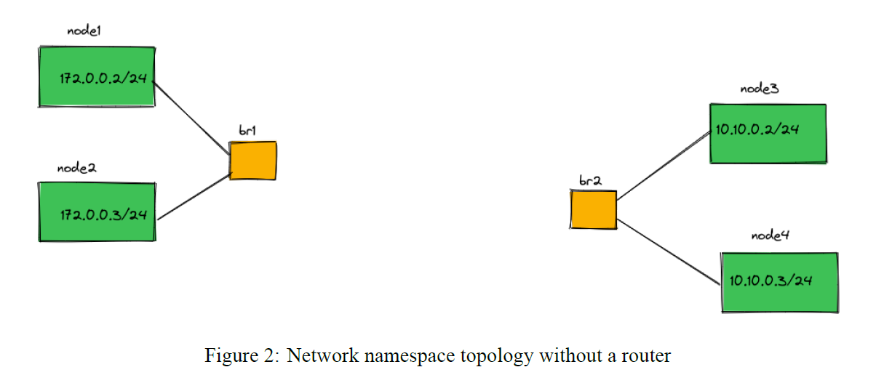
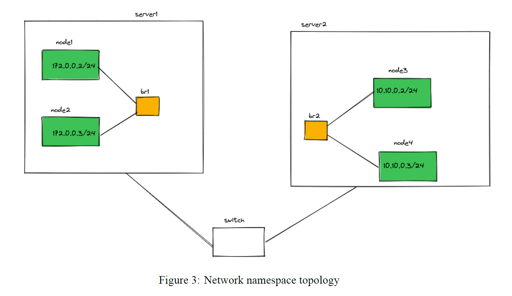

# Problem 1 (Container Networking)
In this problem you get familiar with Container Networking.
It has 3 parts.
## In the first part we impliment the bwlow topology.


For this part we have *Create_topo* and *Pinging_nodes* file.
first we need to create_topo by writing this in our CLI:
```bash
./Create_topology.sh
```
and then for checking, we write this code in our CLI:
```bash
./Pinging_nodes node1 node2
```

## In the second part we delete the router and get bwlow topology.


For routing packets from one subnet to another subnet we follow the Question1_doc.txt 


## In the third part namespaces are on different servers (virtual machine or physical server) that can see each other in layer 2.


to do so we follow the Question2_doc.txt 
