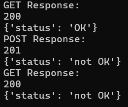

# Simple HTTP server
This problem is about Docker. In this problem we write a simple HTTP server and dockerize it. To do so we use Python language
The HTTP server has only one endpoint: /api/v1/status. This endpoint must handle GET and POST HTTP methods.
When the request method is GET, the server sends this JSON response:
```json
{ "status": "OK" }
```
with status code 200. When the request method is POST with a body like this:
```json
{ "status": "not OK" }
```
The server returns the body:
```json
{ "status": "not OK" }
```
with status code 201. From now on every other GET request is responded with "not OK" status until
another POST request changes it to something else. The server listens on port 8000.

## implimentation
In this repo we have Dockerfile, to make a image of this Dockerfile run this command.
```bash
docker built -t <name_of_container> .
```
and to run the container 
```bash
docker run <name_of_container>
```
Now the httpserver has started, we open another terminal and run clinent.py
```bash
python3 client.py
```
and we get this output:


